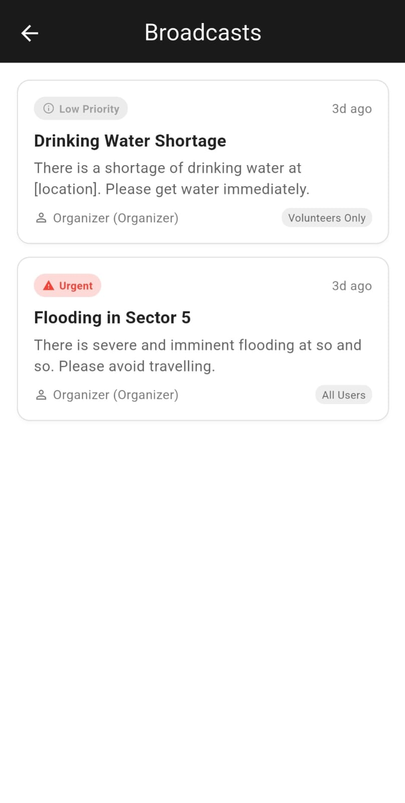

# 🛰️ SimhaLink -TH11990 


[](https://flutter.dev)
[](https://dart.dev)
[](https://firebase.google.com)
[](../../releases)
[](LICENSE)

> 📦 Download: [Latest APK (Google Drive)](https://drive.google.com/file/d/1X5Xs2Z5tLEQ3Snq2kQbv4ssPqpm9EvHM/view?usp=sharing) · Or visit the [Releases](../../releases) tab for versioned builds.

## Intelligent Crowd Safety, Coordination & Ritual Experience Infrastructure

**Mission:** Make large-scale spiritual, cultural, and civic gatherings safer, more inclusive, and data-informed — without sacrificing tradition.

---

## 🧭 Problem Landscape

Mass gatherings (pilgrimages, fairs, festivals, civic events) face recurring challenges:

| Challenge | Real-World Impact |
|-----------|-------------------|
| Overcrowding & congestion | Stampede risk, lost time, reduced participant comfort |
| Fragmented communication | Delayed emergency response & misinformation |
| Limited situational awareness | Organizers lack real-time density & risk visibility |
| Accessibility gaps | Elderly & differently-abled attendees lack timely assistance |
| Manual alert escalation | Slower triage of medical & safety incidents |
| Post-event blind spots | Minimal data retained for planning & policy |

**SimhaLink** addresses these pain points by fusing real-time geospatial data, role-aware workflows, and proactive alerting into a single Android-first platform.

---

## 💡 Solution Overview

SimhaLink is a **Flutter + Firebase powered crowd intelligence and coordination platform** featuring:

- 🔍 Live, layered maps (medical, water, accessibility, historic, emergency zones)
- 👥 Role-bound interfaces (Participants, Volunteers, Organizers, VIPs) with scoped permissions
- 🚨 Structured alert & escalation funnel (report → verify → dispatch → resolve → archive)
- 💬 Context-rich group & targeted messaging (role, zone, incident-linked)
- 🔔 Push notifications & event-driven routing (Firebase Cloud Messaging)
- 🛰️ Modular architecture prepared for future AI & IoT ingestion (density, sensors, drones)

> Designed to scale from a localized gathering to multi-venue pilgrimages with hundreds of thousands of participants.

### 📱 Screenshots

<!-- markdownlint-disable MD033 -->
<div align="center">
	
	
	
	
</div>
<div align="center">
	
	
	
	
</div>
<!-- markdownlint-enable MD033 -->

Note: Screens represent in-development UI; flows and visuals may evolve.

---

## 🔑 Core Feature Set

| Pillar | Features | Impact |
|--------|----------|--------|
| Situational Awareness | Multi-layer map, dynamic markers, role-specific overlays | Faster decision cycles |
| Safety & Response | Alert categorization (medical, crowd, infrastructure), resolution tracking | Reduced response latency |
| Communication | Group chat, broadcast messaging, role & location scoping | Cuts noise, raises clarity |
| Inclusivity | Accessibility markers (ramps, assistance points, water) | Improved attendee well-being |
| Governance | Audit-friendly event logs, structured incident lifecycle | Traceability & accountability |
| Extensibility | Modular services & managers, pluggable data providers | Low friction future integrations |

---

## 👥 Role Flow Snapshot

1. Participant: Reports hazard or requests assistance → auto-tagged with location & type.
2. Volunteer: Receives filtered tasks → acknowledges → updates status.
3. Organizer: Monitors macro view (density hotspots, open incidents) → reallocates resources.
4. VIP: Access to curated itinerary & safe routing overlays.

---

## 🏗️ Architecture & Scalability

| Layer | Responsibility | Current Backing |
|-------|----------------|-----------------|
| UI (Flutter) | Reactive role-based widgets | Modular screens & widgets |
| Managers | Map, auth, alerts, messaging orchestration | Service abstractions |
| Services | Auth, Firestore CRUD, notifications | Firebase Auth, Firestore, FCM |
| Data Models | Marker, Alert, Role, Message | `lib/models/` |
| Config | Environment, theming, map config | `lib/config/` |

**Horizontal Scaling Path:**

1. Phase 1 (Now): Firebase realtime + Firestore partitioned collections.
2. Phase 2: Add Cloud Functions for rule-based auto-escalation & analytics aggregation.
3. Phase 3: Introduce streaming pipeline (Pub/Sub or WebSockets) for density heatmaps.
4. Phase 4: Optional migration adapter to FastAPI microservices (preserved via service abstraction layer).

**Performance & Reliability Considerations:**

- Batched Firestore writes for bulk marker ingestion.
- Indexed queries (geo-hash or bounding-box ready extension).
- Offline-first caching (planned) to maintain minimal map & alert interaction during outages.

---

## 🔒 Data Stewardship & Safety Model

- Principle of Least Privilege: Role gates enforced at UI & Firestore security rules.
- Incident Lifecycle: open → assigned → in-progress → resolved → archived.
- Messaging Separation: Operational (alerts) vs conversational (group chat) channels.
- PII Avoidance: Only minimal identity data retained client-side; extensible for anonymization.

---

## 🌍 Societal Impact Dimensions

| Dimension | Effect |
|-----------|--------|
| Public Safety | Shorter alert-to-action windows reduce escalation risk |
| Health Outcomes | Faster volunteer dispatch improves triage success |
| Inclusivity | Improves navigation for differently-abled & vulnerable groups |
| Sustainability | Data-driven flow optimization lowers infrastructure stress |
| Policy & Planning | Post-event analytics inform zoning & resource planning |
| Cultural Continuity | Supports safer large-scale heritage gatherings |

---

## 🚀 Roadmap (Condensed Evolution Path)

| Stage | Focus | Highlights |
|-------|-------|-----------|
| 1. Safety Core | Stability & alerts | Offline cache, multi-language UI |
| 2. Analytics | Predictive awareness | Density heatmaps, flow prediction |
| 3. Automation | Smart orchestration | IoT ingest, auto-dispatch rules |
| 4. Expansion | Ecosystem | Web organizer console, REST/GraphQL API |
| 5. Immersive Layer | AR & XR | AR wayfinding, digital twin overlays |

Detailed legacy roadmap items (audio streaming, drone integration, blockchain logging, wearable signals, etc.) remain aligned with these stages.

---

## 🧪 Development Quick Start

### Prerequisites

- Flutter (stable channel)
- Android SDK (API level per `compileSdk` in Gradle)
- Java 11+
- Firebase project w/ Auth, Firestore, Messaging enabled

### Setup

```powershell
flutter pub get
```

Ensure Firebase configuration:

- `android/app/google-services.json` present
- `lib/firebase_options.dart` matches your Firebase project (regenerate via `flutterfire configure` if needed)

Run (emulator or device):

```powershell
flutter run
```

Release build:

```powershell
flutter build apk --release
```

### Tests

Add tests under `test/` then run:

```powershell
flutter test
```

---

## 📂 Key Directory Map

| Path | Purpose |
|------|---------|
| `lib/main.dart` | App entry point bootstrap |
| `lib/config/` | Global theming, env, map config |
| `lib/screens/` | Role & feature UI flows |
| `lib/services/` | Firebase + future backend abstractions |
| `lib/models/` | Core data entities |
| `assets/` | Static assets & fonts |
| `test/` | Automated tests |

Refactoring outcomes: reduced monolith size, higher cohesion, clear separation between UI, orchestration (managers), and integration layers.

---

## 🧩 Extensibility Strategy

- Service Layer: Swap Firebase with FastAPI (REST) by implementing adapter classes only.
- Map Engine: Prepared for vendor swap (Google Maps → MapLibre) via abstraction wrapper.
- Analytics: Hook density calculation pipeline w/out rewriting UI (stream adapter pattern).

---

## 🤝 Contributing

1. Fork & branch (`feat/<name>`)
2. Implement & add focused tests
3. Run lints/tests locally
4. Open PR with: scope, rationale, screenshots (UI) or diagrams (architecture)

Coding principles:

- Single responsibility per file
- Declarative UI (prefer stateless where feasible)
- Explicit enums for roles & alert types
- Avoid premature optimization; document extension points

---

## 🧾 License

See `LICENSE` file for usage & redistribution terms.

---

## 📡 Future Integration Targets (Aspirational)

- Sensor fusion (BLE crowd tags, environmental air quality)
- Drone telemetry ingestion (geo-tagged observation events)
- Wearable pulse/heat stress early warning (opt-in privacy layer)
- AR corridor & evacuation overlays

---

## ✨ Why SimhaLink Matters

Because safer, more organized mass gatherings protect lives, preserve cultural heritage, and unlock data that drives smarter urban & event planning — all while keeping the participant experience dignified and inclusive.

> "Operational clarity is the difference between managed flow and unmanaged risk."  

---

## 📬 Contact / Maintainers

Refer to repository metadata & commit history for active maintainers. Proposal & integration discussions welcome via issues.

---

### ✅ Quick Recap

SimhaLink delivers: real-time oversight, structured safety response, role-aware communication, scalable architecture, and a forward path toward predictive and sensor-enhanced crowd intelligence.

---

Built with ❤️ in Flutter — engineered for real-world impact.
